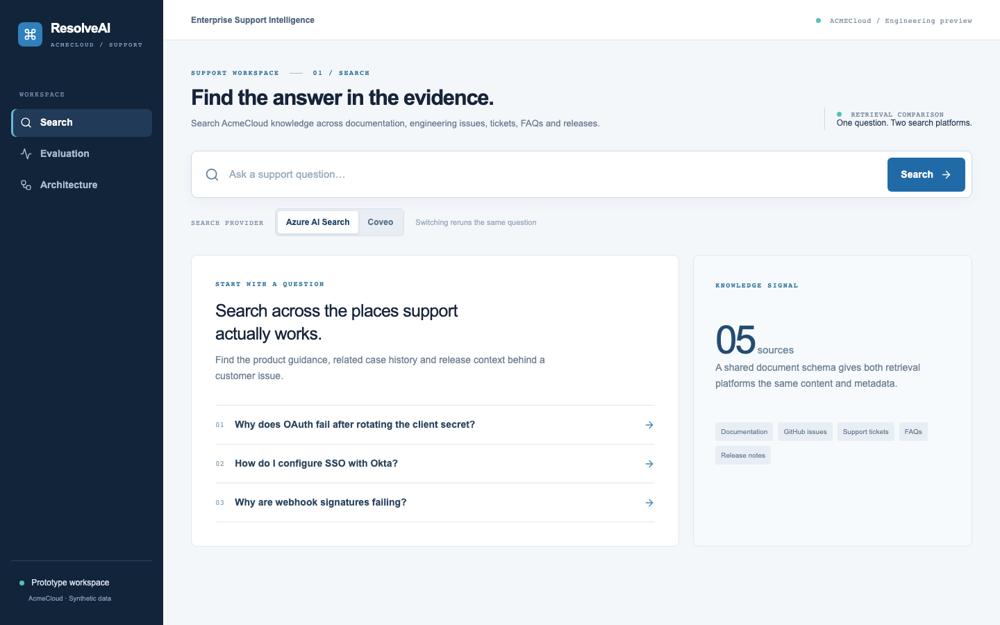

# ResolveAI

[](https://github.com/ankitluthra/ResolveAI/actions/workflows/ci.yml)

ResolveAI is an enterprise support intelligence prototype that unifies fragmented technical knowledge and evaluates Coveo and Azure AI Search as retrieval platforms for search and grounded AI experiences.

## Customer problem

AcmeCloud, a fictional developer platform, answers support questions using scattered docs, FAQs, GitHub issues, tickets, and release notes. A question about OAuth secret rotation may require all four. [Customer discovery](docs/customer-brief.md) turns the original request — “We want an AI assistant that can answer technical support questions using all of our company knowledge” — into measurable retrieval, access, grounding, and latency requirements.

## Solution

A reproducible connector and normalizer produce 250 synthetic records across five source types. The same canonical corpus is uploaded to Azure AI Search and a Coveo Push source. FastAPI presents a shared `SearchProvider` contract to a Next.js support workspace, evaluation runner, and optional grounded answer layer.

## Demo

1. Open the Search workspace and ask: **Why does OAuth fail after rotating the client secret?**
2. Inspect results, filters, and retrieval diagnostics.
3. Switch providers; the URL preserves the query.
4. Generate an answer and open a cited local source record (requires OpenAI credentials).
5. Review recorded Hit@1, Hit@3, MRR, latency, and query-level rankings on Evaluation.



The welcome and architecture pages work without credentials; live search and measured scores require configured services.

## Architecture

```text
Five source types → Normalize → KnowledgeDocument
                                  ↙         ↘
                         Azure AI Search   Coveo
                                  ↘         ↙
                          SearchProvider contract
                          ↙         ↓         ↘
                    Search UI   Evaluation   Grounded answer
```

See [architecture](docs/architecture.md) and [decisions](docs/decisions.md).

## Features

- Unified search and filters for source, product, category, update date, and visibility.
- Isolated Azure AI Search and Coveo adapters, server-side credentials, and URL-backed provider switching.
- Clickable source records and retrieval diagnostics.
- Grounded OpenAI response with validated source IDs and insufficient-evidence fallback.
- A fixed 20-question dataset and live evaluation runner.

## Evaluation

The dashboard intentionally shows **no benchmark numbers** until the live runner succeeds. The evaluation script records Hit@1, Hit@3, MRR, average latency, and every returned document ID. [Experiments](docs/experiments.md) defines two hypotheses without invented results.

## Engineering decisions

Canonical normalization preserves stable IDs across providers. Provider-specific HTTP calls remain at the boundary. The answer layer receives retrieved excerpts only. The fixed relevance set precedes tuning. [Seven ADRs](docs/decisions.md) explain these tradeoffs.

## Running locally

Requires Python 3.11+, Node 20+, `uv`, and credentials for each live integration.

```bash
cp .env.example .env
uv sync --project apps/api --extra dev
npm install --prefix apps/web
apps/api/.venv/bin/python -m scripts.seed_data
```

Edit `.env` at the repository root. For the web app, place `NEXT_PUBLIC_API_URL=http://localhost:8000` in `apps/web/.env.local`.

### Azure AI Search

Create an Azure AI Search service and obtain its endpoint and admin key. Set `AZURE_SEARCH_ENDPOINT`, `AZURE_SEARCH_API_KEY`, and `AZURE_SEARCH_INDEX`. From the repository root, run:

```bash
apps/api/.venv/bin/python -m scripts.sync_azure
```

This creates the index and uploads the normalized corpus. The service uses the `2024-07-01` [Azure AI Search REST API](https://learn.microsoft.com/en-us/rest/api/searchservice/). The demo runs keyword search; semantic/hybrid ranking is reserved for a measured experiment on a supported tier.

### Coveo

Create a trial organization and a **public [Push source](https://docs.coveo.com/en/1546/) named `ResolveAI Knowledge`**. Create custom fields `ra_id`, `ra_source_type`, `ra_product`, `ra_category`, `ra_visibility`, `ra_tags`, and `ra_updated_at` with matching names so Push source automapping can populate them. Set `ra_updated_at` to Date and enable facets/search operators for fields used by filters. Create an API key with [Push API](https://docs.coveo.com/en/78) access to the source and [Search API](https://docs.coveo.com/en/1445/) access to the organization. Set `COVEO_ORG_ID`, `COVEO_API_KEY`, `COVEO_SOURCE_ID`; set the region-specific `COVEO_PUSH_BASE_URL` and, if necessary, `COVEO_SEARCH_ENDPOINT`. Then run:

```bash
apps/api/.venv/bin/python -m scripts.sync_coveo
```

Use public source settings only for this synthetic corpus. Indexing is asynchronous, so wait until the source shows 250 searchable items before evaluating.

### API, UI, and evaluation

```bash
apps/api/.venv/bin/uvicorn apps.api.app.main:app --reload --port 8000
npm run dev --prefix apps/web
```

Open `http://localhost:3000`. Run evaluation after each index is searchable:

```bash
curl -X POST 'http://localhost:8000/api/evaluations/run?provider=azure'
curl -X POST 'http://localhost:8000/api/evaluations/run?provider=coveo'
```

Optional grounded answers require `OPENAI_API_KEY` in the root `.env`. Run `apps/api/.venv/bin/pytest -q apps/api/tests` and `npm run build --prefix apps/web` for local checks.

## Project structure

`apps/api` contains the FastAPI endpoints and provider adapters. `apps/web` contains the Next.js workspace. `ingestion` owns connector and normalization code. `data/synthetic` is source input; `data/normalized` is the generated canonical corpus. `evals` contains the fixed relevance set and measured run output. `scripts` contains repeatable CLI commands.

## Limitations

The records are fictional and templated. Their source URLs use a reserved example domain; the workspace opens a local source view instead. No live provider indexing, benchmark result, or OpenAI answer can be claimed until credentials and platform configuration are supplied. Visibility is demonstrative metadata, **not access control**. Coveo field mapping must be verified in the configured trial. There is no delete sync yet.

## Production evolution

Add identity, enforceable provider permissions, real connectors, PII controls, incremental updates and deletes, retries, audit logs, observability, tenant isolation, and a larger customer-reviewed evaluation set. See [production considerations](docs/production-considerations.md).
